# Configure a comms path for Home Assistant with CTPlus

[← Documentation](Documentation) · [Panel setup](Panel-Setup) · [Configuration](Configuration)

This guide creates a dedicated **Computer Event Driven** Ethernet communication path for TecomHA. The screenshots show example values; use the IP address, ports, credentials and encryption key for your own installation.

> **Important:** Back up the panel configuration before making changes. In CTPlus, open **Administration** and export the panel and system configuration as appropriate for your installation.

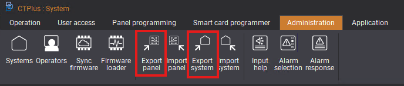

## 1. Create a dedicated communication path

Use a spare communication-path record and give it a descriptive name such as `HomeAssistant`. Home Assistant must not share the path used by the CTPlus desktop application.

On the **Main** tab, configure:

| Setting | Value |
| --- | --- |
| **Interface location** | `On Board` |
| **Format** | `Computer Event Driven` |
| **Interface port** | `Ethernet` |

TecomHA supports either the classic **Security password** method or **User name and password** authentication. Configure only the method you intend to use, then enter the same credentials in Home Assistant.

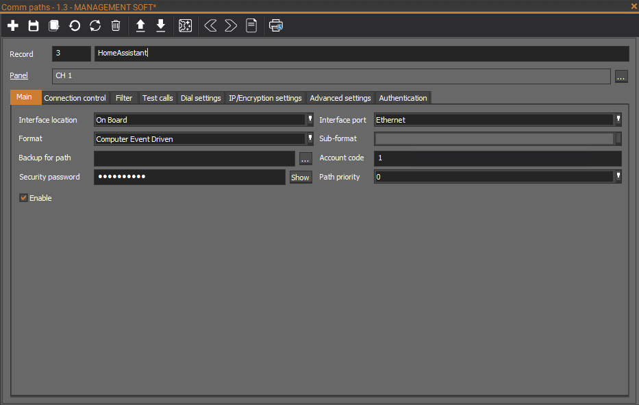

## 2. Configure connection control

On the **Connection control** tab, enable:

- **Always connect**
- **Stay connected on empty buffer**
- **Control command**
- **Isolated inputs trigger path**

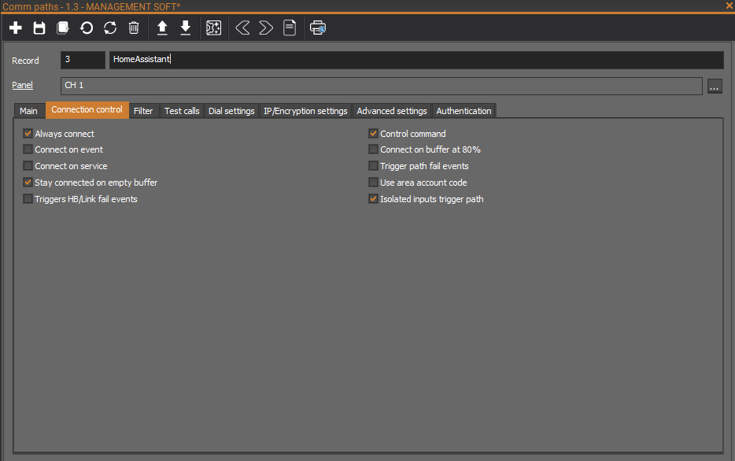

## 3. Configure the event filter

On the **Filter** tab, enable the event categories TecomHA needs:

- **Report alarm events**
- **Report connection events**
- **Report system alarms**
- **Report communication events**
- **Report access events**
- **Multi-break alarms**
- **Multi-break restores**
- **Report open/close**

An event category excluded here will not be delivered to Home Assistant.

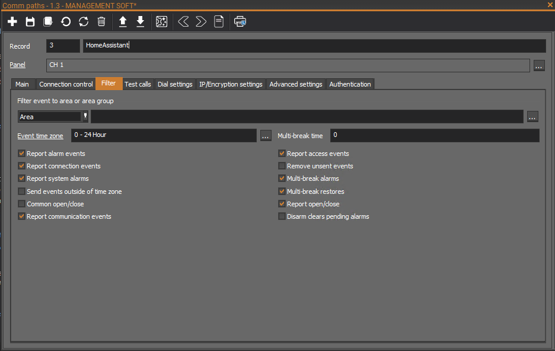

## 4. Disable test calls

On the **Test calls** tab, set **Test call type** to `No test call`.

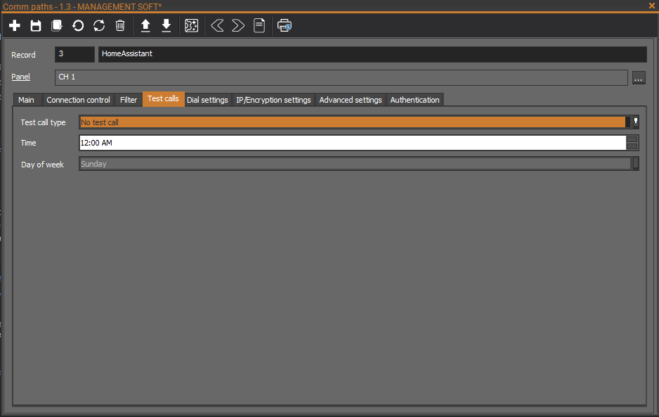

## 5. Leave dial settings unused

No dial settings are required for the Ethernet path. Leave the **Dial settings** tab unconfigured.

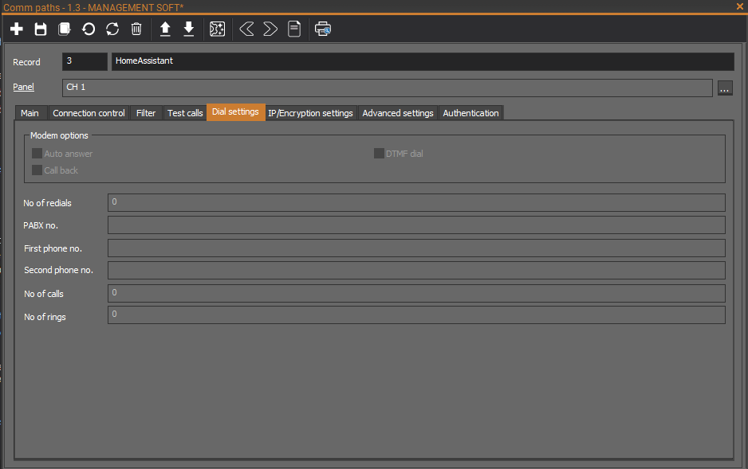

## 6. Configure IP and encryption

On the **IP/Encryption settings** tab, configure:

| Setting | Value |
| --- | --- |
| **IP options** | `UDP/IP` |
| **Send to address** | The static IP address of the Home Assistant host |
| **Send port** | A port reserved for this Home Assistant path |
| **Receive port** | A port reserved for this Home Assistant path |
| **Encryption type** | Prefer `AES CBC, 128 bit` or `AES CBC, 256 bit`; `None` is supported |
| **Encryption key** | A key you choose and enter exactly the same way in TecomHA |

> **Port note:** The ports for this path must not conflict with the separate communication path used by CTPlus. Send and receive ports may use the same number when both endpoints are configured that way. If you use different numbers, match each direction in the TecomHA configuration.

The IP address and port numbers in the screenshot are examples only. Do not copy them unless they match your network design.

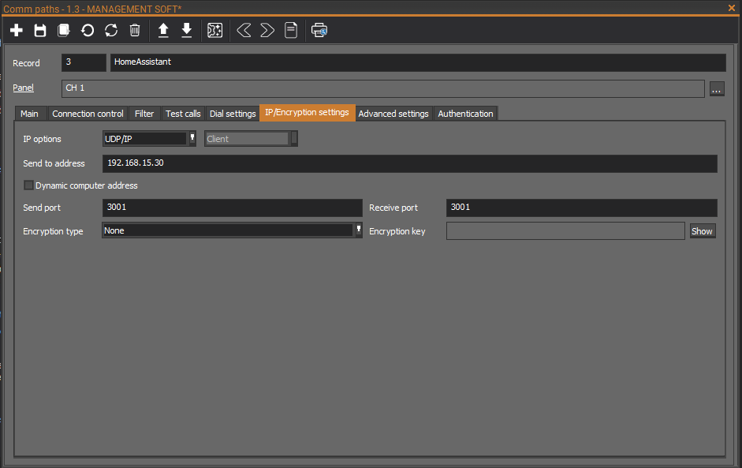

## 7. Configure advanced settings

On the **Advanced settings** tab, use the following values:

| Setting | Value |
| --- | ---: |
| **Message ack** | `5000 ms` |
| **Connect timeout** | `30 sec` |
| **Heartbeat timeout** | `0 sec` |
| **Wait time between connections** | `5 sec` |
| **Computer attempts** | `255` |
| **Connect retries** | `0` |
| **Message retries** | `3` |

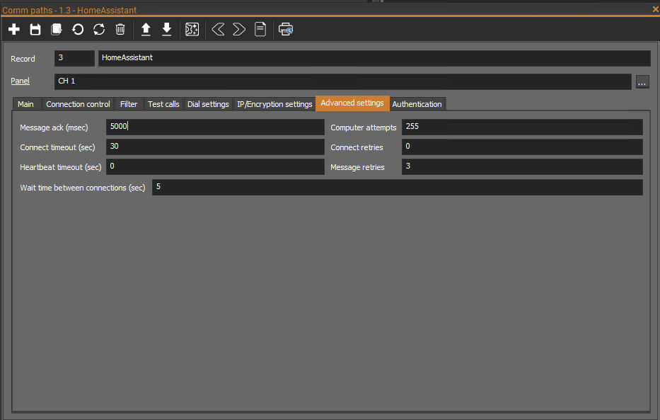

## 8. Choose an authentication method

The **Authentication** tab lets you use a path user name and password instead of the classic computer/security password.

| Method | Where to configure it |
| --- | --- |
| **Security / computer password** | Enter the path's **Security password** on the **Main** tab and leave the **Authentication** tab empty |
| **Path user name and password** | Enter both values on the **Authentication** tab; the security/computer password is then not used |

Whichever method you choose must match the **Authentication type** and credentials configured in TecomHA.

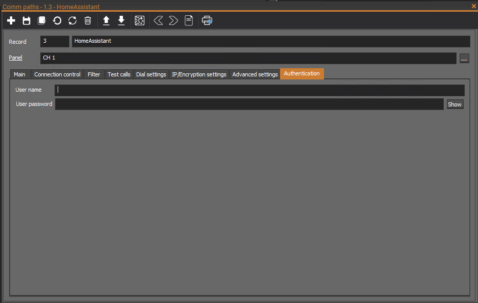

## 9. Save and send the configuration

Save the communication path, ensure it is enabled, and send the updated configuration to the panel. Then configure TecomHA with the matching panel address, ports, authentication method and encryption settings.

For field-by-field TecomHA guidance, see [Configuration](Configuration#connection-authentication-and-encryption). For network and compatibility details, see [Panel setup](Panel-Setup).

## 10. Import CTPlus names into TecomHA

TecomHA can apply CTPlus object names to entities that are already loaded in Home Assistant.

1. In CTPlus, open **Administration** and select **Export panel**.
2. Save the resulting `export.panel` file.
3. Copy it to a location under Home Assistant's `/config` directory that TecomHA can read, for example `/config/export.panel`.
4. Open **Settings → Devices & services → TecomHA → Configure**.
5. Under **Naming from export.panel**, enter the full path and enable the object groups you want to rename.
6. Save the integration options.

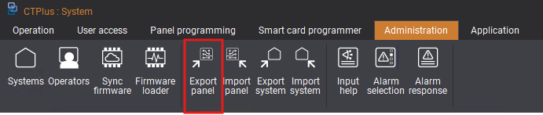

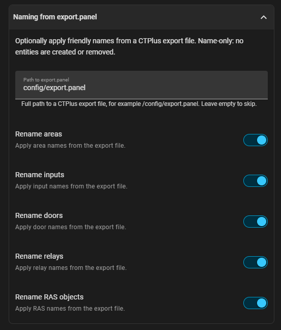

The import applies friendly names only. It does not create or remove entities. If names change later, replace `export.panel` and reload the TecomHA integration.

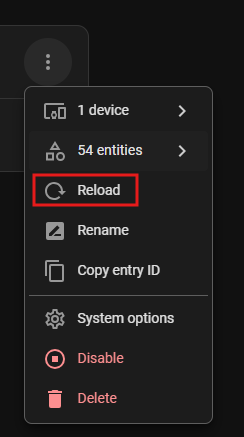

## Next steps

- [Configure TecomHA](Configuration)
- [Review panel setup and troubleshooting notes](Panel-Setup)
- [Review entity scope and limitations](Entities#scope-and-limitations)
